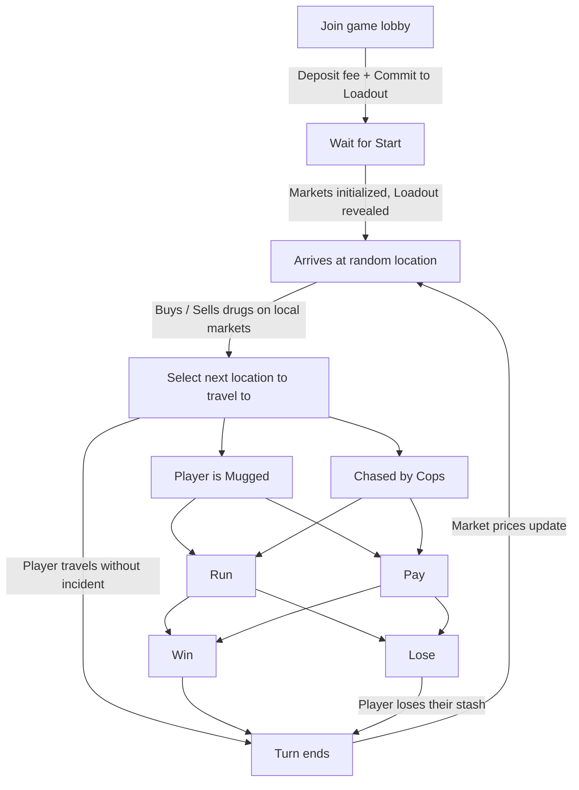

# Roll Your Own

![Github Actions][gha-badge]

[gha-badge]: https://img.shields.io/github/actions/workflow/status/cartridge-gg/rollyourown/test.yml?branch=main

Roll Your Own is an onchain adaptation of the original Drug Wars game, built on Starknet using the [Dojo Engine](https://github.com/dojoengine/dojo).

## Development

Install the latest Dojo toolchain from [releases](https://github.com/dojoengine/dojo/releases) or follow the [installation guide](https://book.dojoengine.org/getting-started/installation.html)

### With Katana

```bash
# Start Katana
katana --disable-fee

# Build the game
sozo build

# Migrate the world, this will declare/deploy contracts to katana and take note of the world address
sozo migrate

# Start indexer, graphql endpoint at http://localhost:8080
torii --world {world_address}

# Setup default authorization
./scripts/default_auth.sh [local]

# Start frontend, located at http://localhost:3000
cd web
yarn install && yarn dev
```

<details>
<summary>Any errors during the `sozo build` command?</summary>
<br>
This might be because your version of sozo is not correct.
<br><br>
Check the `Scarb.toml` file and get the `rev` tag from the `dojo` dependency:
<pre>
[dependencies]
dojo = { git = "https://github.com/dojoengine/dojo.git", rev = "ca2d2e6dd1ef0fe311310ba0728be8743b1d5cc8" }
</pre>

In this example, this is how we would to install the correct version:
<pre>
> git clone https://github.com/dojoengine/dojo.git
> cd dojo
> git checkout ca2d2e6dd1ef0fe311310ba0728be8743b1d5cc8
> dojoup -p .
</pre>

This will reinstall the correct version of `sozo` in your `~/.dojo/bin` folder.

</details>


Note: If the world address your game is deployed to is different, you'll need to update it in three places currently

- Scarb.toml
- script/default_auth.sh
- web/src/constants.ts

### With Madara

TBD

## Mechanics

As in the original, players will land in Dope Wars locations, arbitraging the price of drugs in an attempt to stack paper and own the streets.

RYO extends the core game mechanic of arbitraging drugs in different neighborhoods to a multiplayer environment where each player’s actions affect the in-game economy, creating a competitive and evolving environment. During each turn, a player will travel to a neighborhood, review the current market prices for drugs, and decide to Buy or Sell. After each turn is complete, the market prices will be affected by the previous player’s turn, adding a new layer of strategy to the game. Random events affect prices between turns to avoid making the game too deterministic.

### Game Loop

The following game loop is repeated until the end condition of the game is reached:



### Future improvements

Currently, game initialization state is hidden during the `join` phase, players commit to a loadout (i.e. their weapons, clothing, etc) and reveal it upon their first turn. Once the game has begun, market state is randomly initialized (each location contains a constant product market) and players can start the game loop. Market state is transparent, players can view the prices at other locations as well as other player balances.

- Player inventories should be hidden until the game end condition is reached, at which point, they would reveal their current inventory
- Mugging is currently PVE, eventually, it would be cool to do it PVP, in which case, the mugger should not know the loadout of their target until the mugging is performed. Ideally there is a mechanism to force the "mugger" and "muggee" to reveal their loadout. See https://github.com/FlynnSC/zk-hunt#search


