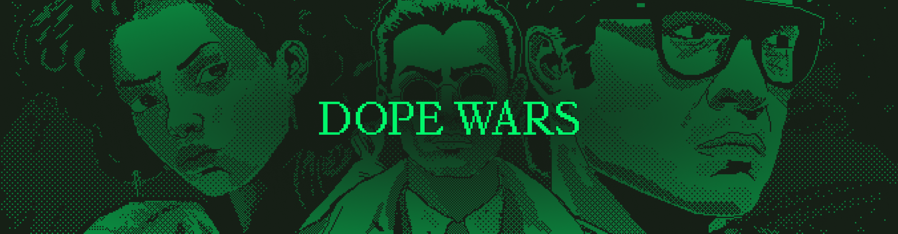

# Roll Your Own

![Github Actions][gha-badge]

[gha-badge]: https://img.shields.io/github/actions/workflow/status/cartridge-gg/rollyourown/test.yml?branch=main

Roll Your Own is an onchain adaptation of the original Drug Wars game, built on Starknet using the [Dojo Engine](https://github.com/dojoengine/dojo).

### Development

Install the latest Dojo toolchain from [releases](https://github.com/dojoengine/dojo/releases) or follow the [installation guide](https://book.dojoengine.org/getting-started/installation.html)

```bash
# Start Katana
katana --seed 0

# Build the game
sozo build

# Migrate the world, this will declare/deploy contracts to katana,
# update the world address in Scarb.toml
sozo migrate

# Create a game, execute calldata params are defined in create_game system
sozo execute create_game --calldata 1686521389,2,30

# View the schema of the Game Component
sozo component schema Game
> struct Game {
>    start_time: u64
>    max_players: usize
>    num_players: usize
>    max_turns: usize
>    is_finished: bool
>    creator: u250
> }

# Get the value of the Game (0 represents game_id key)
sozo component entity Game 0
> 0x6486462d
> 0x2
> 0x1
> 0x1e
> 0x0
> 0x03ee9e18edc71a6df30ac3aca2e0b02a198fbce19b7480a63a0d71cbd76652e0

# Try other commands like join_game and travel/trade

# Start indexer, graphql endpoint at http://localhost:8080
torii --world-address 0x7d17bb24b59cb371c9ca36b79efca27fe53318e26340df3d8623dba5a7b9e5f --manifest path_to_target/manifest.json

```

Sozo will eventually contain all commands required to interact with your world. However, CLIs like [starknet-probe](https://github.com/kariy/starknet-probe) or [starkli](https://github.com/xJonathanLEI/starkli) can also be used to interact directly with Katana. Due to JSON-RPC spec differences starknetpy may have issues.

### Mechanics

As in the original, players will land in Dope Wars locations, arbitraging the price of drugs in an attempt to stack paper and own the streets.

RYO extends the core game mechanic of arbitraging drugs in different neighborhoods to a multiplayer environment where each player’s actions affect the in-game economy, creating a competitive and evolving environment. During each turn, a player will travel to a neighborhood, review the current market prices for drugs, and decide to Buy or Sell. After each turn is complete, the market prices will be affected by the previous player’s turn, adding a new layer of strategy to the game. Random events affect prices between turns to avoid making the game too deterministic.

#### Game Loop

The following game loop is repeated until the end condition of the game is reached:


#### Future improvements

Currently, game initialization state is hidden during the `join` phase, players commit to a loadout (i.e. their weapons, clothing, etc) and reveal it upon their first turn. Once the game has begun, market state is randomly initialized (each location contains a constant product market) and players can start the game loop. Market state is transparent, players can view the prices at other locations as well as other player balances.

- Player inventories should be hidden until the game end condition is reached, at which point, they would reveal their current inventory
- Mugging is currently PVE, eventually, it would be cool to do it PVP, in which case, the mugger should not know the loadout of their target until the mugging is performed. Ideally there is a mechanism to force the "mugger" and "muggee" to reveal their loadout. See https://github.com/FlynnSC/zk-hunt#search
