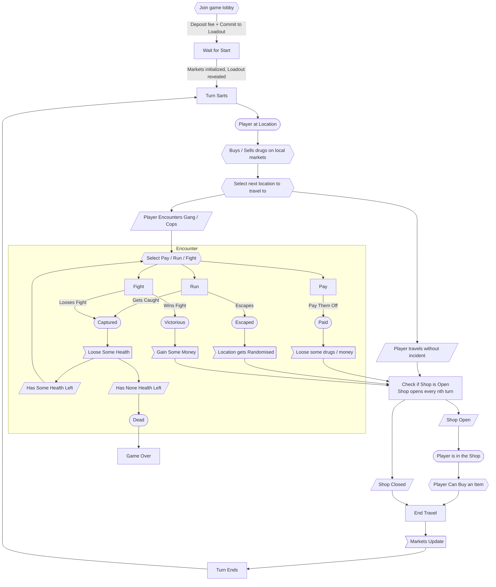

# Dope Wars

![Github Actions][gha-badge]

[gha-badge]: https://img.shields.io/github/actions/workflow/status/cartridge-gg/rollyourown/test.yml?branch=main

Dope Wars is an onchain adaptation of the original Drug Wars game, built on Starknet using the [Dojo Engine](https://github.com/dojoengine/dojo).

## Development

Install the latest Dojo toolchain from [releases](https://github.com/dojoengine/dojo/releases) or follow the [installation guide](https://book.dojoengine.org/getting-started/quick-start.html)

### With Katana

```bash
# Start Katana
katana --disable-fee

# Build the game
sozo build

# Migrate the world, this will declare/deploy contracts to katana and take note of the world address
sozo migrate

# Start indexer, graphql endpoint at http://localhost:8080
torii --world {world_address}

# Setup default authorization & initialization
./scripts/default_auth.sh [local]

# Copy manifest.json into web directory & do graphql/ts codegen
./scripts/gen.sh

# Start frontend, located at http://localhost:3000
cd web
yarn install && yarn dev
```

In Scarb.toml, there is various shortcut defined using scripts.
For exemple `scarb run migrate` will execute `sozo migrate` then gen.sh / default_auth.sh

```bash
sozo build && scarb run migrate
```

#### Any errors when doing `sozo build` ?

This might be because your version of sozo is not correct.

Check the `Scarb.toml` file and get the `rev` or `tag` from the `dojo` dependency:
```toml
[dependencies]
dojo = { git = "https://github.com/dojoengine/dojo.git", rev = "ca2d2e6dd1ef0fe311310ba0728be8743b1d5cc8" }
# or
dojo = { git = "https://github.com/dojoengine/dojo.git", tag = "v0.3.15"}
```

In this example, this is how we would install the correct `rev` version:
```bash
git clone https://github.com/dojoengine/dojo.git
cd dojo
git checkout ca2d2e6dd1ef0fe311310ba0728be8743b1d5cc8
dojoup -p .
```

For tagged version, you can use dojoup:
```bash
dojoup -v v0.3.15
```

This will reinstall the binaries in your `~/.dojo/bin` folder.

### With Madara

TBD

## Mechanics

As in the original Drug Wars, players will land in a fictional NYC, arbitraging the price of drugs in an attempt to stack paper and own the streets.

Dope Wars extends the core game mechanic of arbitraging drugs in different neighborhoods to a multiplayer environment where each player’s actions affect the in-game economy, creating a competitive and evolving environment. During each turn, a player will travel to a neighborhood, review the current market prices for drugs, and decide to Buy or Sell. After each turn is complete, the market prices will be affected by the previous player’s turn, adding a new layer of strategy to the game. Random events affect prices between turns to avoid making the game too deterministic.

### Game Loop

The following game loop is repeated until the end condition of the game is reached:



### Future improvements

Currently, game initialization state is hidden during the `join` phase, players commit to a loadout (i.e. their weapons, clothing, etc) and reveal it upon their first turn. Once the game has begun, market state is randomly initialized (each location contains a constant product market) and players can start the game loop. Market state is transparent, players can view the prices at other locations as well as other player balances.

- Player inventories should be hidden until the game end condition is reached, at which point, they would reveal their current inventory
- Mugging is currently PVE, eventually, it would be cool to do it PVP, in which case, the mugger should not know the loadout of their target until the mugging is performed. Ideally there is a mechanism to force the "mugger" and "muggee" to reveal their loadout. See https://github.com/FlynnSC/zk-hunt#search

## Game Components NFT Implementation

> **Living plan for DopeWars' embeddable game integration**
>
> This document captures the current state of the integration, the architectural decisions that shaped it, and the reasoning behind every major change. It should be updated whenever we touch the minigame token lifecycle, ownership semantics, or the metadata surface.

---

### Implementation Snapshot
- Adopted the `GameToken` Dojo model as an adapter between ERC-721 token IDs and the `Game` composite key, avoiding a breaking refactor of core storage (`src/models/game_token.cairo`, `src/store.cairo`).
- Added `minigame_token_id` to the `Game` model to persist the binding between a playthrough and its NFT, enabling ownership resolution long after the game starts (`src/models/game.cairo`).
- Standardised token-gated gameplay by routing every user entrypoint through `assert_token_ownership`, `pre_action`, and `post_action`, ensuring transfers immediately take effect and metadata stays fresh (`src/systems/game.cairo`, `src/systems/decide.cairo`, `src/systems/laundromat.cairo`).
- Introduced the `resolve_current_owner*` helpers to reconcile historical `player_id` values with the live ERC-721 owner, so achievements, rewards, and event emissions always credit the wallet that currently holds the game (`src/helpers/game_owner.cairo`).
- Wired the minigame contract to Denshokan during `dojo_init`, giving marketplaces a verified renderer/registry out of the box and keeping the integration aligned with Cartridge conventions (`src/systems/game_token/contracts.cairo`).
- Hardened the flow with forked integration tests that mint, transfer, and exercise the tokenized game loop, covering creation, travel, encounters, score registration, and claims (`src/tests/systems/*.cairo`, `src/tests/test_helpers.cairo`).

---

### Requirements Recap
1. Every active DopeWars session must correspond to a tradable ERC-721 token that renders live state (score, status, player handle).
2. Ownership of the token is the single source of truth for who may play, finish, or claim rewards for that session.
3. Metadata must update on-chain without forcing a redesign of the existing `Game` storage model.
4. The solution must compose with the Dojo world, Denshokan registry, and client handshake used across other Cartridge minigames.

---

### Architecture Rationale

#### Solving Token/Game ID Divergence
- **Problem.** The Dojo `Game` model is keyed by `(game_id, player_id)` where `game_id` is a world-wide UUID. The ERC-721 contract inside the game-components stack mints its own sequential `token_id`. Assuming `game_id == token_id` fails as soon as these values diverge/unsync.
- **Decision.** Persist a dedicated mapping in `GameToken { token_id, game_id, player_id }`. This lives under the `dopewars` namespace so any system can read it through `world.read_model(token_id)` (`src/models/game_token.cairo`).
- **Reasoning.** We preserve the stability of the existing storage layout (no migrations, no downstream breaking changes) while giving every system a constant-time lookup from NFT to game data. The adapter pattern keeps the legacy composite key intact for all non-token aware code.

#### Binding Minigame Tokens to Game Sessions
- **`Game.minigame_token_id`.** Storing the minted token ID on the `Game` record is essential for ownership reconciliation later (`src/models/game.cairo:53`). It is initialised to `0` so legacy data remains valid, and set once during `create_game`.
- **`assert_game_not_started`.** Before a session binds to a token we confirm the placeholder `GameToken` entry is empty (`game_id == 0`, `player_id == 0`). This prevents re-using the same NFT for multiple runs and keeps metadata consistent with gameplay (`src/systems/game.cairo:385`).
- **Lifecycle hooks.** Every gameplay entrypoint calls:
  1. `assert_token_ownership(token_address, token_id)` – authoritative guard provided by the minigame library.
  2. `pre_action(token_address, token_id)` – checks that the game is not over/is playable.
  3. Domain logic (create, travel, decide, etc.).
  4. `post_action(token_address, token_id)` – updates cached metadata so wallets display fresh values without polling events.
  This contract with the renderer is consistent across all systems (`src/systems/game.cairo`, `src/systems/decide.cairo`, `src/systems/laundromat.cairo`).
- **Store utilities.** `Store::game_by_token_id` centralizes the mapping logic so individual systems stay lean and impossible-to-forget checks live in one place (`src/store.cairo:41` onwards).

#### Ownership Resolution and Guards
- **Live owner resolution.** Because `player_id` records the wallet that *started* the session, every place where we emit events, award Bushido tasks, or pay out claims now calls `resolve_current_owner` (game data → ERC-721 owner) or `resolve_current_owner_by_token` (token ID → owner) (`src/helpers/game_owner.cairo`).
- **Why two helpers.** Some contexts (e.g. laundromat claims) only know the token ID, while others (trading/shopping/traveling helpers) already operate on loaded `GameStore` data. Splitting the helpers avoids redundant world reads and keeps loops tight.
- **Guard coverage.** `assert_token_ownership` executes at the boundary of every user action (`create_game`, `travel`, `decide`, `end_game`, `laundromat.register_score`, `laundromat.claim`). This guarantees that as soon as a token transfers, the previous owner can no longer mutate game state or drain rewards.
- **Events & achievements.** By resolving the current owner before emitting `TradeDrug`, `UpgradeItem`, or encounter results, we ensure achievements follow the tradable asset, not the historical player. This was necessary once games became transferable (`src/systems/helpers/trading.cairo`, `src/systems/helpers/shopping.cairo`, `src/systems/helpers/traveling.cairo`).

#### Metadata Surface (Renderer & Token Systems)
- **Score.** The score endpoint returns the player's current cash from the packed game store (`src/systems/game_token/contracts.cairo:83`). Cash mirrors leaderboard value and is the most familiar metric for players.
- **Game over.** The renderer reports an NFT as `game_over` when either the stored game loop flag is set *or* the game’s `season_version` no longer matches the active season. The latter prevents stale, previous-season games from masquerading as live runs in wallets (`src/systems/game_token/contracts.cairo:103`).
- **Player name.** Exposed through `IGameTokenSystems::player_name`, which proxies to the minigame component’s player registry. This delegates to the shared component, keeping metadata consistent across integrations.
- **Renderer choice.** We intentionally ship with the default renderer while the gameplay loop stabilises. All required metadata is in place, and the minigame initializer stores enough context to swap to a bespoke SVG once design assets are ready.

#### Denshokan Integration
- **Initializer wiring.** `dojo_init` feeds the creator address, collection metadata, and the network-specific Denshokan registry address into the minigame initializer (`src/systems/game_token/contracts.cairo:41`). This gives marketplaces access to our metadata without additional migration steps.
- **Reasoning.** Denshokan is Cartridge’s canonical registry for embeddable games. Registering at init time standardises discoverability, enables wallet UI reuse, and avoids ad-hoc environment variables in the web client.
- **Test configuration.** Fork tests load the provable DopeWars Denshokan address so the ownership helpers interact with a realistic ERC-721 contract (`src/tests/test_helpers.cairo:16`).

---

### Token Lifecycle & Update Flow

1. **Minting.**
   - The client (or tests) calls `IMinigameDispatcher::mint_game`.
   - The minigame component mints an ERC-721 token and returns the new `token_id`.
2. **Game creation (`create_game`).**
   - Caller provides the minted `minigame_token_id`.
   - Contract confirms the caller currently owns the token and that no game has started with it.
   - Generates a new Dojo `game_id`, seeds randomness, writes `Game` and `GameStorePacked`, persists `GameToken { token_id, game_id, player_id }`, and updates the `Game.minigame_token_id`.
   - Emits `GameCreated` and invokes `post_action` so wallets refresh.
3. **Gameplay (`travel`, `decide`, helper actions).**
   - Every turn validates token ownership, resolves the `Game` through the mapping, and records achievements/events against the current owner.
   - After mutations, `post_action` pushes metadata changes (score, status) to the renderer.
4. **Endgame & laundromat.**
   - Ending a game or registering a score still requires token ownership. Laundromat flows use `resolve_current_owner_by_token` to track transfers that happen post-game.
   - Claimers must hold the token at the moment of claiming; otherwise transactions revert (`src/systems/laundromat.cairo:60` and tests).

---

### Token Transfer Experience

1. **Transfer.** Owners transfer the ERC-721 via their Cartridge wallet or otherwise.
2. **Immediate enforcement.**
   - All entrypoints that mutate game state use `assert_token_ownership`. Once the transfer transaction mines, the old owner can no longer call `travel`, `decide`, `end_game`, or `register_score` (`src/tests/systems/game.cairo:56`, `src/tests/systems/decide.cairo:20`, `src/tests/systems/laundromat.cairo:20`).
3. **Metadata continuity.** Because metadata is derived from on-chain game state, the new owner sees an updated NFT immediately after calling `post_action` from the first interaction they make.
4. **Reward routing.** `resolve_current_owner_by_token` ensures laundromat claims pay the new owner, and the tests assert that the original owner cannot claim after a transfer (`src/tests/systems/laundromat.cairo:33`).

---

### Testing Strategy & Coverage

#### World & Minigame Setup
- `src/tests/setup_world.cairo` builds a forked `dopewars` namespace including the `game_token_system_v0` contract and seeds it with the Denshokan address used on provable DopeWars. This keeps ownership helpers and token interactions faithful to mainnet behaviour.
- `setup_world_with_mint` and `setup_world_with_game` wrap the boilerplate: they mint a minigame token, start a game, and return dispatcher handles for test scenarios (`src/tests/test_helpers.cairo`).

#### Behavioural Coverage
- **Creation guardrails.**
  - `test_owner_can_create_game` / `test_non_owner_cannot_create_game` confirm only the NFT holder can start a session.
  - `test_cannot_create_game_twice_with_same_token` validates the zeroed `GameToken` sentinel and `assert_game_not_started`.
- **Gameplay enforcement.**
  - Travel, decide, and end-game tests verify non-owners are rejected and invalid token IDs revert (`src/tests/systems/game.cairo`, `src/tests/systems/decide.cairo`).
  - Integration tests check that ownership transfers take effect instantly: the old owner’s travel call fails, while the new owner succeeds.
- **Laundromat / claims.**
  - Tests prove only the current owner can register scores or claim rewards, and transferred owners inherit claim rights while the original owner is blocked (`src/tests/systems/laundromat.cairo`).
- **Helper correctness.**
  - `resolve_current_owner` is exercised implicitly through the achievement awarding paths. Additional direct assertions (`test_owner_can_create_game`) confirm the helper matches expectations after game creation.

Collectively these tests protect the invariants around token ownership, transfer responsiveness, and metadata updates.

---

### Client Handshake & Observability
- Frontends mint tokens through the minigame contract, then pass the returned `token_id` into `create_game`. The system enforces that the `token_id` always matches the NFT currently held by the caller.
- After each gameplay transaction, clients can rely on `post_action` having refreshed metadata. Wallets or explorers reading the default renderer immediately reflect the new score or status.
- `IGameTokenSystems::player_name` exposes a lightweight read endpoint the web client can hit without pulling the entire `Game` struct.

---

### References
- `src/models/game_token.cairo`: GameToken adapter model.
- `src/models/game.cairo`: Game storage including `minigame_token_id`.
- `src/store.cairo`: Token-aware store helpers.
- `src/helpers/game_owner.cairo`: Ownership resolution utilities.
- `src/systems/game.cairo`, `src/systems/decide.cairo`, `src/systems/laundromat.cairo`: Token-gated systems enforcing the lifecycle hooks.
- `src/systems/game_token/contracts.cairo`: Minigame contract, initializer, and renderer-facing endpoints.
- `src/tests/setup_world.cairo`, `src/tests/test_helpers.cairo`, `src/tests/systems/*.cairo`: Forked integration tests covering minting, transfers, and gameplay.

---
